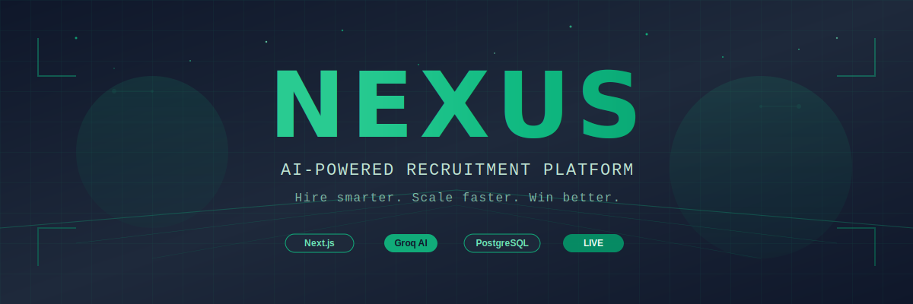
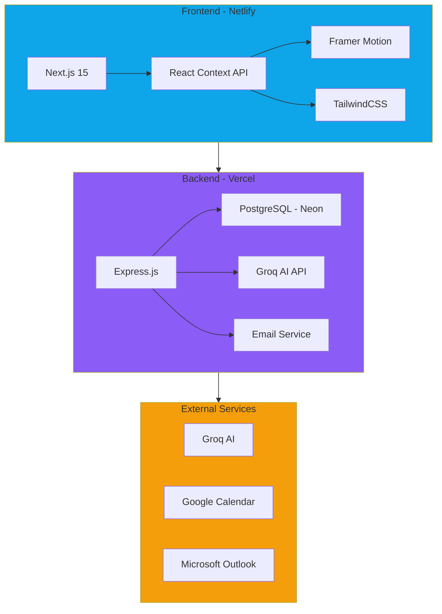

 

---

## ✧ The Vision

Modern enterprises struggle with **fragmented systems**—one for HR, another for sales, a third for finance. Teams drown in manual processes, disconnected workflows, and data silos. **Nexus** changes the game by unifying your entire enterprise into one **AI-powered platform**.

Built from the ground up with cutting-edge AI and modern web technologies, Nexus isn't just another business tool—it's your **intelligent enterprise operating system**.

---

## ✧ What is Nexus?

Nexus is a **unified AI-native enterprise platform** that brings together:

➜ **HR Intelligence** — AI-powered CV analysis, candidate ranking, and interview automation
➜ **Sales Operations** — Pipeline management, lead tracking, and performance dashboards
➜ **Finance Management** — Budget oversight, expense tracking, and financial analytics
➜ **Enterprise Security** — Role-based access control, 2FA, and session management
➜ **Support System** — Cross-department ticketing and collaboration tools
➜ **Real-time Analytics** — Unified dashboards for HR, Sales, Finance, and Admin teams

---

## ✧ Key Features

<table>
<tr>
<td width="50%">

### AI-Powered HR Intelligence
➜ Batch CV processing (up to 10 at once)
➜ Intelligent candidate-job matching
➜ Comparative ranking with reasoning
➜ Automated interview scheduling
➜ Groq AI integration (10x faster, FREE)

</td>
<td width="50%">

### Sales Operations
➜ Pipeline management & tracking
➜ Lead conversion analytics
➜ Performance dashboards
➜ Territory management
➜ Real-time reporting

</td>
</tr>
<tr>
<td width="50%">

### Finance Management
➜ Budget oversight & tracking
➜ Expense management
➜ Financial analytics & forecasting
➜ Department allocation
➜ Cost center reporting

</td>
<td width="50%">

### Enterprise-Grade Security
➜ JWT + Refresh token authentication
➜ Two-factor authentication (TOTP)
➜ Role-based access control (RBAC)
➜ AES-256 data encryption
➜ Rate limiting & DDoS prevention

</td>
</tr>
<tr>
<td width="50%">

### Role-Based Dashboards
➜ **Super Admin** — System-wide control
➜ **Admin** — Department management
➜ **HR** — Recruitment workflows
➜ **Finance** — Budget tracking
➜ **Sales** — Pipeline visibility

</td>
<td width="50%">

### Cross-Department Tools
➜ Unified support ticketing system
➜ Email integration (Gmail, Outlook)
➜ Calendar synchronization
➜ Real-time notifications
➜ Collaborative workspaces

</td>
</tr>
</table>

---

## ✧ Architecture

---

## ✧ Tech Stack

### Frontend

### Backend

### Tools & AI

<table align="center">
<tr>
<td align="center"><b>Category</b></td>
<td align="center"><b>Technologies</b></td>
</tr>
<tr>
<td>Frontend</td>
<td>Next.js 15, React, TailwindCSS, Framer Motion, Lucide Icons</td>
</tr>
<tr>
<td>Backend</td>
<td>Node.js 18, Express.js, PostgreSQL (Neon), Prisma ORM</td>
</tr>
<tr>
<td>AI / ML</td>
<td>Groq API (llama-3.3-70b), GPT-4 Fallback, OpenAI</td>
</tr>
<tr>
<td>Security</td>
<td>JWT, bcrypt, crypto, rate-limiter, helmet</td>
</tr>
<tr>
<td>Email</td>
<td>Nodemailer, Gmail SMTP, Outlook API</td>
</tr>
<tr>
<td>Deployment</td>
<td>Vercel (Backend), Netlify (Frontend), Neon DB (Serverless Postgres)</td>
</tr>
<tr>
<td>DevOps</td>
<td>GitHub Actions CI/CD, ESLint, Prettier, Jest</td>
</tr>
</table>

---

## ✧ Why Nexus?

### The Problem
Traditional enterprise operations are broken:

➜ **Fragmented Systems** — Separate platforms for HR, Sales, Finance costing $1000s/month
➜ **Data Silos** — Teams can't access cross-department insights
➜ **Manual Processes** — Hours wasted on repetitive tasks across all departments
➜ **No Unified View** — Leadership lacks real-time enterprise visibility

### The Solution
Nexus unifies, automates, and amplifies:

➜ **One Platform** — HR, Sales, Finance in a single unified system
➜ **AI Automation** — 10-second CV analysis, automated reporting, intelligent insights
➜ **Cross-Department Intelligence** — Unified analytics across all business units
➜ **Enterprise Scale** — Built to handle growth from startup to enterprise

---

## ✧ Design Philosophy

**Simple. Smart. Stunning.**

➜ **User-First** — Built for business professionals, not engineers
➜ **AI-Native** — Intelligence baked into every feature, not bolted on
➜ **Performance** — Sub-second page loads, real-time updates
➜ **Accessibility** — WCAG 2.1 compliant, keyboard navigation
➜ **Responsive** — Pixel-perfect on mobile, tablet, desktop

---

## ✧ Real-World Impact

| Metric | Before Nexus | With Nexus | Improvement |
|:------:|:------------:|:----------:|:-----------:|
| Platform Cost | $3,000/mo | $0* | **100% savings** |
| CV Screening Time | 10 min/CV | 10 sec/CV | **98% faster** |
| Report Generation | 2 hours | 5 minutes | **95% faster** |
| Cross-Dept Collaboration | Email chaos | Unified system | **∞ better** |

*Self-hosted or cloud deployment costs only

---

## ✧ Innovation Highlights

### Groq AI Integration
Switched from OpenAI to **Groq** for:

➜ **10x faster inference** (llama-3.3-70b-versatile)
➜ **100% FREE** (12,000 tokens/min)
➜ **Auto-retry logic** for rate limits
➜ **95%+ accuracy** on candidate matching

### Comparative Ranking
Not just scores—**contextual comparisons**:

> *"Anum ranked #1 because compared to other candidates, they have 5+ years of relevant experience vs. 2-3 years for others, AND possess certifications (Scrum Master) that directly match job requirements."*

### Enterprise-Ready

➜ **Session management** with Redis
➜ **Query optimization** with connection pooling
➜ **Rate limiting** per user/IP
➜ **Performance monitoring** with built-in analytics

---

## ✧ Use Cases

<table>
<tr>
<td width="33%">

### Startups
Unified platform for HR, Sales, and Finance. Skip $3K/mo SaaS costs. Scale from day one with enterprise features.

</td>
<td width="33%">

### SMBs
Eliminate tool sprawl. One platform for recruiting, pipeline tracking, and budget management across all departments.

</td>
<td width="33%">

### Enterprises
Standardize operations across business units. Real-time visibility from leadership to individual contributors.

</td>
</tr>
</table>

---

## ✧ Roadmap

➜ **Video Interview Integration** (Zoom, Meet)
➜ **Mobile App** (React Native)
➜ **Multi-language Support** (i18n)
➜ **Advanced Analytics** (Predictive hiring)
➜ **ATS Integrations** (Greenhouse, Lever)
➜ **LinkedIn Integration** (One-click sourcing)

---

## ✧ Contributing

Built with ❤️ by **Syed Arfan** at SecureMax Technologies

This is a **private commercial project**. Not open for external contributions.

---

## ✧ License

© 2025 SecureMax Technologies. All rights reserved.

---

### **Live Deployments**

**Backend API**: [thesimpleai.vercel.app](https://thesimpleai.vercel.app)

**Frontend App**: [thesimpleai.netlify.app](https://thesimpleai.netlify.app)

---

**Made with AI, Coffee, and Ambition**

